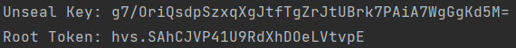
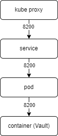

University: [ITMO University](https://itmo.ru/ru/)\
Faculty: [FICT](https://fict.itmo.ru)\
Course: [Introduction to distributed technologies](https://github.com/itmo-ict-faculty/introduction-to-distributed-technologies)\
Year: 2023/2024\
Group: K4113C\
Author: Semisalov Daniil Vladimirovich\
Lab: Lab 1\
Date of create: 23.10.2023\
Date of finished: 26.10.2023
## Лабораторная работа №1 "Установка Docker и Minikube, мой первый манифест."

Был создан pod для Vault с единственным портом ```8200```:

```bash 
kubectl apply -f pod.yml
```

Далее был прокинут порт для pod:

```bash 
kubectl port-forward pod/vault 8200:8200 
```

Дальнейшее наблюдение можно делать через следующие команды:

```bash 
kubectl get po # Покажет все доступные поды в namespace
```

```bash 
minikube dashboard # Откроет дашборд в виде UI со всей актуальной информации по каждому namespace
```

```bash 
kubectl logs <pod-name> # Покажет все логи внутри указанного пода
```

Через логи был получен токен для авторизации в поднятом Vault:



Схема организации:


