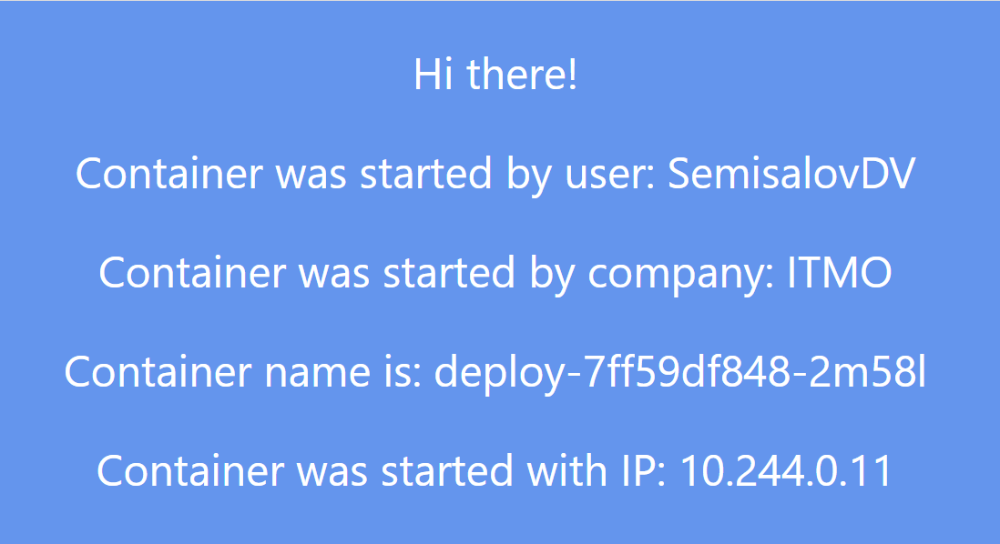
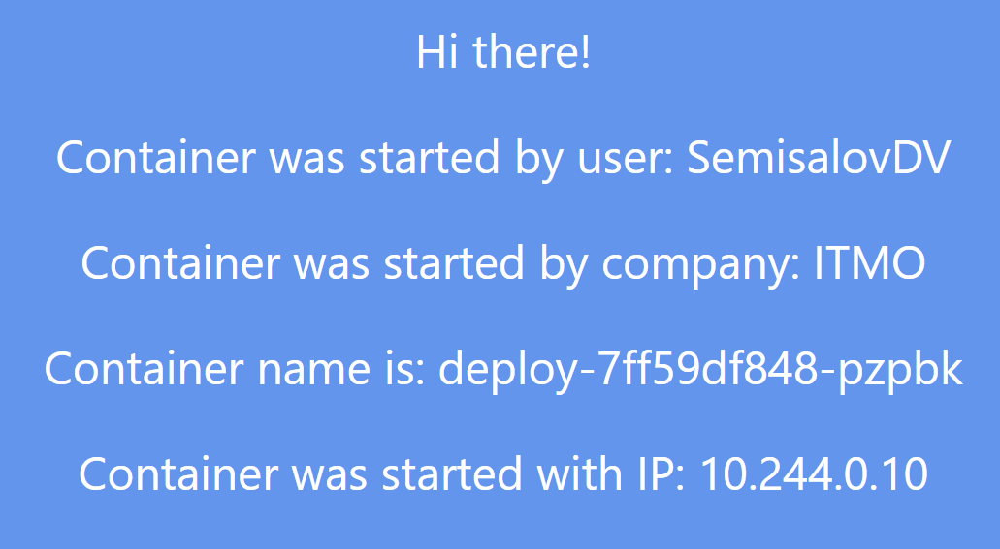
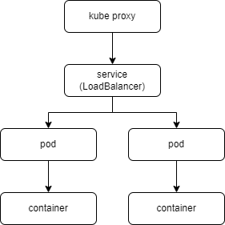

University: [ITMO University](https://itmo.ru/ru/)\
Faculty: [FICT](https://fict.itmo.ru)\
Course: [Introduction to distributed technologies](https://github.com/itmo-ict-faculty/introduction-to-distributed-technologies)\
Year: 2023/2024\
Group: K4113C\
Author: Semisalov Daniil Vladimirovich\
Lab: Lab 2\
Date of create: 24.10.2023\
Date of finished: dd.mm.2023
## Лабораторная работа №2 "Развертывание веб сервиса в Minikube, доступ к веб интерфейсу сервиса. Мониторинг сервиса."

Был создан Deployment и Service (LoadBalancer) с единственным портом ```3000```:

```bash 
kubectl apply -f deployment.yml
```

Далее был запущен туннель, для доступа по 127.0.0.1:3000:

```bash 
minikube tunnel 
```

Дальнейшее наблюдение можно делать через следующие команды:

```bash 
kubectl get po # Покажет все доступные поды в namespace
```

```bash 
minikube dashboard # Откроет дашборд в виде UI со всей актуальной информации по каждому namespace
```

```bash 
kubectl logs <pod-name> # Покажет все логи внутри указанного пода
```

При переходе на 127.0.0.1:3000 будет открываться либо один контейнер, либо второй из-за работы LoadBalancer:




Схема организации namespace:

