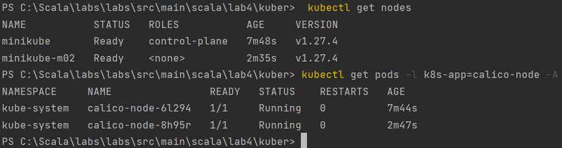
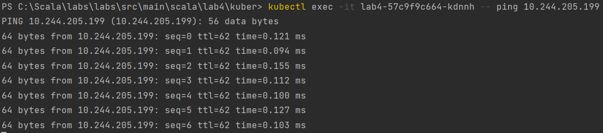
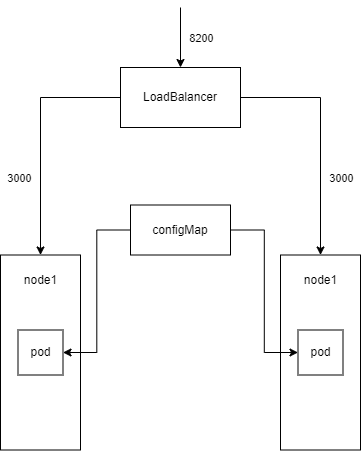

University: [ITMO University](https://itmo.ru/ru/)  
Faculty: [FICT](https://fict.itmo.ru)  
Course: [Introduction to distributed technologies](https://github.com/itmo-ict-faculty/introduction-to-distributed-technologies)  
Year: 2023/2024  
Group: K4113c  
Author: Semisalov Daniil 
Lab: Lab4  
Date of create: 23.11.2023  
Date of finished: dd.mm.yyyy
---

## Ход работы
### 1. Запуск Minikube и нод
- Запускаем minikube вместе с calico:
```
minikube start --network-plugin=cni --cni=calico
```
- Проверяем наши ноды (их должно быть одинаковое количество, по поду на ноду):
```
kubectl get nodes
```
```
kubectl get pods -l k8s-app=calico-node -A
```

### 2. Настройка IPAM
- Задаем метки для наших node при помощи nodes.yml
```
kubectl apply -f nodes.yml
```
```yml
apiVersion: v1
kind: Node
metadata:
  name: minikube
  labels:
    nodeName: node1
---
apiVersion: v1
kind: Node
metadata:
  name: minikube-m02
  labels:
    nodeName: node2
```
- Удаляем существующий IPPool и создаем для каждой ноды собственный
Удаляем IPPool 
```
calicoctl delete pool default-ipv4-ippool
```
Создаем собственный при помощи ipam.yml
```
calicoctl apply -f - < ipam.yaml
```
```yml
apiVersion: projectcalico.org/v3
kind: IPPool
metadata:
  name: node1
spec:
  cidr: 10.10.0.0/24
  ipipMode: Always
  natOutgoing: true
  nodeSelector: nodeName == "node1"
---
apiVersion: projectcalico.org/v3
kind: IPPool
metadata:
  name: node2
spec:
  cidr: 10.10.1.0/24
  ipipMode: Always
  natOutgoing: true
  nodeSelector: nodeName == "node2"
```
### 3. Создаем манифест для веб-сервиса
Создаем наш deployment.yml
```
kubectl apply -f deployment.yml
```
```yml
apiVersion: v1
kind: ConfigMap
metadata:
  name: lab4
  labels:
    app: lab4
data:
  react_app_username: "Semisalov Daniil"
  react_app_company_name: "ITMO"
---
apiVersion: apps/v1
kind: Deployment
metadata:
  name: lab4
spec:
  replicas: 2
  selector:
    matchLabels:
      app: lab4
  template:
    metadata:
      labels:
        app: lab4
    spec:
      containers:
        - name: itdt-contained-frontend
          image: ifilyaninitmo/itdt-contained-frontend:master
          ports:
            - containerPort: 3000
          env:
            - name: REACT_APP_USERNAME
              valueFrom:
                configMapKeyRef:
                  name: lab4
                  key: react_app_username
            - name: REACT_APP_COMPANY_NAME
              valueFrom:
                configMapKeyRef:
                  name: lab4
                  key: react_app_company_name
---
apiVersion: v1
kind: Service
metadata:
  name: lab4-service
  labels:
    app: lab4
spec:
  selector:
    app: lab4
  ports:
    - protocol: TCP
      port: 8200
      targetPort: 3000
  type: LoadBalancer
```
Пишем ```minikube tunnel``` для доступа к подам из браузера


### 4. Ping
Проверяем доступ одного пода в другой
```
kubectl exec -it lab4-57c9f9c664-kdnnh -- ping 10.244.205.199
```


## Схема

